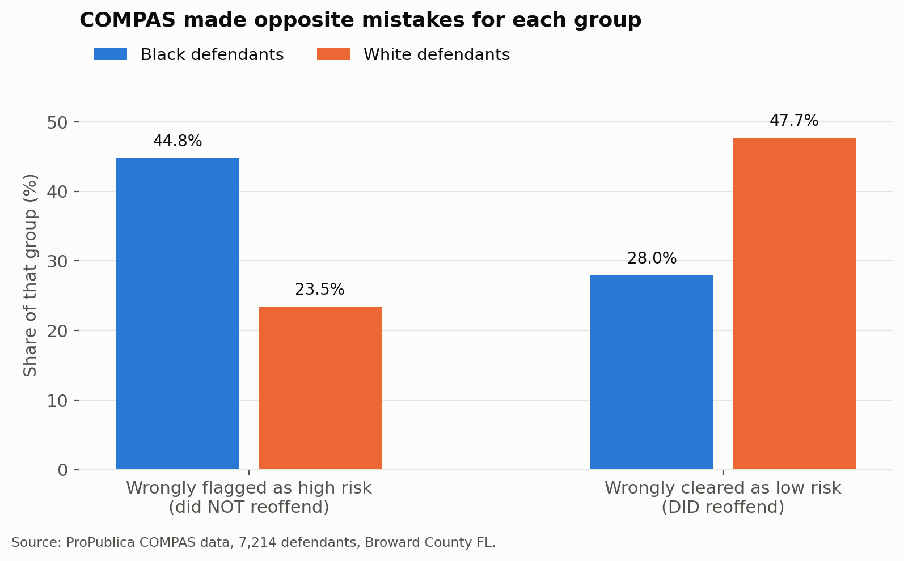
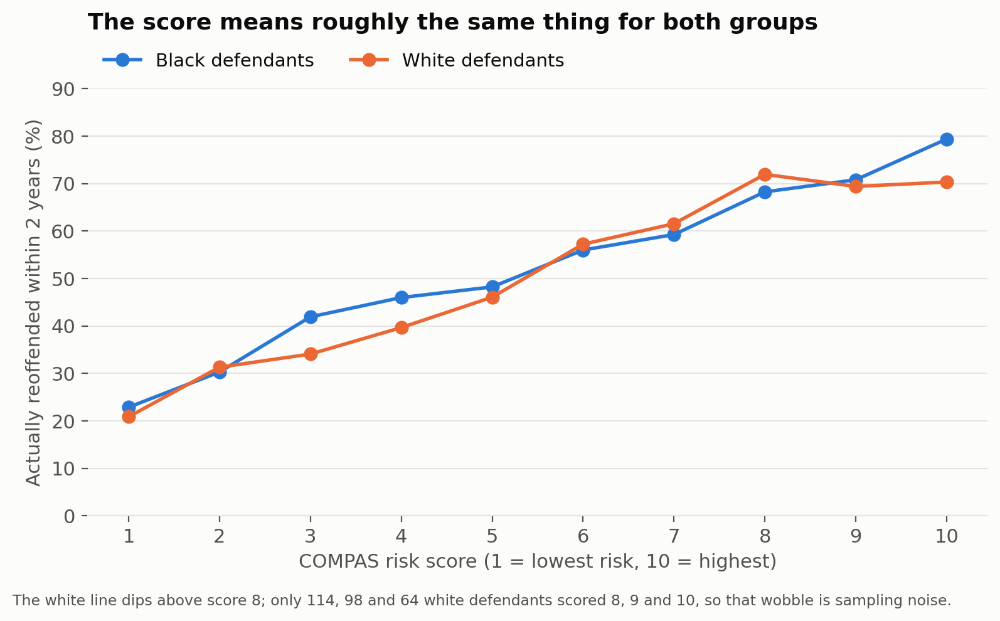
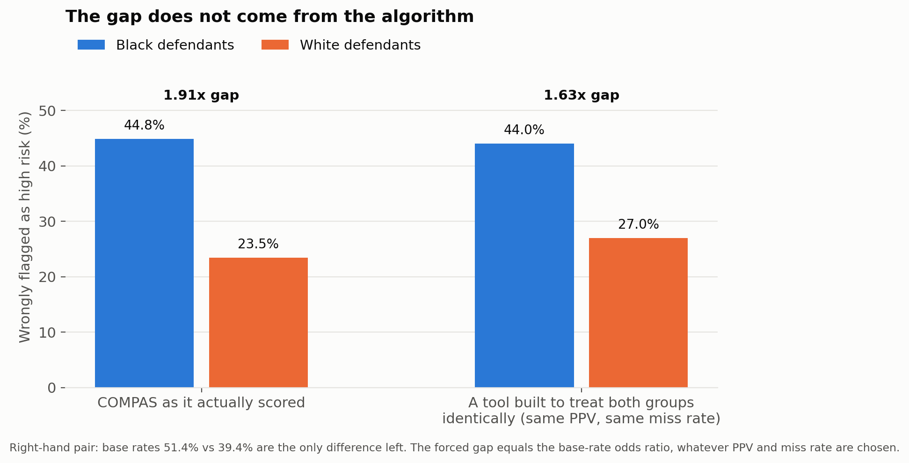

# Algorithmic Fairness Audit

**Is the COMPAS criminal risk score racially biased? ProPublica said yes. The vendor said
no. Both were right.**




COMPAS scores US defendants 1 to 10 on how likely they are to reoffend. Judges use those
scores for bail and sentencing decisions. In 2016 ProPublica reported the tool was biased
against Black defendants. Northpointe, the vendor, replied that it was fair. Both sides had
evidence and both were correct. This repository rebuilds both arguments from the raw data
and shows why they cannot both be satisfied.

**Full write up:** [compas-fairness-report.pdf](compas-fairness-report.pdf)

## Summary

| Measure | Black defendants | White defendants | Ratio |
| --- | --- | --- | --- |
| False positive rate | 44.85% | 23.45% | 1.91x |
| False negative rate | 27.99% | 47.72% | 0.59x |
| Positive predictive value | 0.63 | 0.59 | 1.07x |
| Base rate of re-arrest | 51.43% | 39.36% | 1.31x |

## 1. Data and sample selection

The dataset is ProPublica's COMPAS release for Broward County, Florida, covering 2013 to
2014.

ProPublica used two subsets and this matters. All **7,214** rows produced the contingency
tables and the widely quoted error rates. A **6,172** row subset, dropping cases where
arrest and screening were more than 30 days apart, was used only for their regression.
This repository reports the 7,214 figures as primary and the 6,172 figures as a robustness
check. The disparity is 1.9x under either specification. Applying the 30 day filter to
everything is a common mistake and it shifts the numbers by about two points.

## 2. Findings

### 2.1 Error rates: ProPublica's finding


Among defendants who did **not** reoffend, Black defendants were flagged high risk almost
twice as often. The rates are 44.85% against 23.45%. The error reverses in the other
direction. Among those who **did** reoffend, white defendants were cleared as low risk
nearly twice as often, 47.72% against 27.99%.

### 2.2 Calibration: Northpointe's rebuttal



A score carries roughly the same meaning whoever holds it. A 5 is close to a coin flip for
both groups. A 10 is roughly 70 to 80 percent for both. When COMPAS flags high risk it is
correct 63% of the time for Black defendants and 59% for white defendants. The score is
**calibrated**.

### 2.3 The impossibility result



Four quantities are locked together by an identity:

```
FPR = ( p / (1 - p) ) x ( (1 - PPV) / PPV ) x ( 1 - FNR )
```

Here `p` is the base rate, `PPV` is how often a high risk flag is correct, `FNR` is how
often real reoffenders are missed, and `FPR` is how often people who did not reoffend are
flagged. Fix any three and the fourth is decided.

The base rates differ here. They are 51.43% and 39.36%. So a tool that treats both groups
*identically* on calibration still produces a **1.63x** gap in wrongly flagged people. Take
the ratio and the PPV and FNR terms cancel. What remains is exactly the base rate odds
ratio. The forced gap does not move with the chosen operating point. This was verified
across 800 combinations of PPV and FNR, where the spread was 1e-15.

**"Fair" is not one thing.** Equal PPV or equal FPR. You may have either but not both,
unless the base rates match. That is a choice about values and it cannot be delegated to an
engineer.

## 3. Validation

`src/check_against_propublica.py` verifies every cell of both contingency tables against
ProPublica's published notebook output. It checks row counts, all four cells per race, the
derived rates, and data sanity. It fails loudly on any drift rather than reporting a near
match.

```
ALL CHECKS PASSED - my numbers match ProPublica's published output.
```

## 4. Scope and limitations

This reproduces ProPublica's contingency table analysis only. Their full study also
included a logistic regression on score disparity and a Cox proportional hazards model on
predictive accuracy. Neither is covered here.

- **The label is re-arrest, not crime.** Arrest depends on where police patrol and who gets
  stopped. The base rate gap is itself partly a product of unequal enforcement. So
  "calibrated" means calibrated to arrests.
- **Calibration is not strictly monotonic for white defendants above decile 8.** Only 114,
  98 and 64 of them scored 8, 9 and 10. The 95% intervals overlap heavily, so the reversal
  is sampling noise rather than a defect.
- **One county, one period.** Broward County, Florida, 2013 to 2014. Nothing here
  generalises automatically.

## 5. Reproducing this work

### 5.1 Data

The raw CSV is not committed here. Download it and place it at
`data/raw/compas-scores-two-years.csv`:

```bash
curl -o data/raw/compas-scores-two-years.csv \
  https://raw.githubusercontent.com/propublica/compas-analysis/master/compas-scores-two-years.csv
```

### 5.2 Install

```bash
pip install -r requirements.txt
```

Python 3.9 or newer. Only pandas and matplotlib are required.

### 5.3 Run

Run the steps in order. Each one writes its output to `data/` or `images/`.

```bash
python src/step1_load_data.py            # load and filter, matching ProPublica's rules
python src/step2_error_rates.py          # ProPublica's finding
python src/step3_calibration.py          # Northpointe's defence
python src/step4_impossibility.py        # the identity that binds them
python src/step5_charts.py               # the three figures
python src/check_against_propublica.py   # verify against their published output
```

### 5.4 Files

```
src/
  step1_load_data.py             load, filter, write compas_clean.csv
  step2_error_rates.py           contingency tables and error rates by race
  step3_calibration.py           recidivism rate per decile score
  step4_impossibility.py         Chouldechova's identity and the forced gap
  step5_charts.py                the three figures
  check_against_propublica.py    cell by cell verification, fails on drift
data/
  raw/                           the downloaded CSV goes here, gitignored
  compas_clean.csv               filtered working set
  calibration_by_score.csv       recidivism rate per decile
images/                          the three figures
report.html                      one page write up
compas-fairness-report.pdf       the same report, exported
```

## 6. References

**Data and the original investigation.**
[ProPublica](https://github.com/propublica/compas-analysis) obtained the records, published
the dataset, and released their full analysis. This repository reproduces part of their
work. It does not discover it.

- Julia Angwin, Jeff Larson, Surya Mattu, Lauren Kirchner. *Machine Bias.* ProPublica,
  23 May 2016.
  [Article](https://www.propublica.org/article/machine-bias-risk-assessments-in-criminal-sentencing)
- Jeff Larson, Surya Mattu, Lauren Kirchner, Julia Angwin. *How We Analyzed the COMPAS
  Recidivism Algorithm.* ProPublica, 23 May 2016.
  [Methodology](https://www.propublica.org/article/how-we-analyzed-the-compas-recidivism-algorithm)
- Dataset and notebook at
  [github.com/propublica/compas-analysis](https://github.com/propublica/compas-analysis)

**The result being reproduced.**

- Alexandra Chouldechova. *Fair prediction with disparate impact: A study of bias in
  recidivism prediction instruments.* 28 February 2017.
  [arXiv:1703.00056](https://arxiv.org/abs/1703.00056)
- Jon Kleinberg, Sendhil Mullainathan, Manish Raghavan. *Inherent Trade-Offs in the Fair
  Determination of Risk Scores.* ITCS 2017.
  [arXiv:1609.05807](https://arxiv.org/abs/1609.05807). This proves a closely related
  impossibility independently.

**The other side of the argument.** Northpointe, now Equivant, published a rebuttal arguing
COMPAS satisfies predictive parity. Their case is the one reproduced in section 2.2 and it
deserves to be read directly rather than through its critics.

**Tools.** pandas, matplotlib, and their maintainers.

## 7. Licence

MIT for the code, see [LICENSE](LICENSE). The COMPAS data belongs to ProPublica under their
own terms.